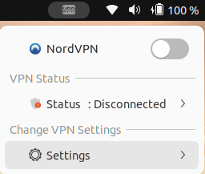
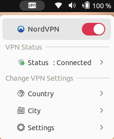
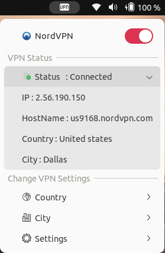
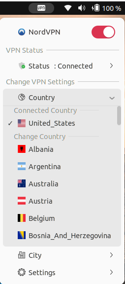

## How to Install
This extension uses the NordVPN command line client, which can be set up as follow.

### Install NordVPN
1. Install NordVPN - [Instructions can be found here.](https://support.nordvpn.com/Connectivity/Linux/1325531132/Installing-and-using-NordVPN-on-Debian-Ubuntu-Raspberry-Pi-Elementary-OS-and-Linux-Mint.htm)
2. Configure your credentials with __nordvpn login__ -> follow the prompts.
3. Check NordVPN is set up with __nordvpn c__ or __nordvpn connect__, if it connects successfully then you're good to go.

## Installing the extension:

Create a folder for the extension with:v

1. Create the Directory
```
mkdir ~/usr/.local/share/gnome-shell/extensions/nordvpn@subipokharel.github.com/
```
2. Copy the files from this repo into that folder
```
    a. cd "~/usr/.local/share/gnome-shell/extensions/nordvpn@subipokharel.github.com"
    b. git clone "https://github.com/Subipokharel/NordVPN-ubuntuextension.git"
```
3. Enable the extension in Extensions

## Extension Screenshots

### 1. Example of the PanelMenu

|      VPN OFF       |         VPN ON          |      VPN Details       |
:-------------------:|:-----------------------:|:----------------------:|
|||     |


### 2. VPN Settings - Change Country/ Country by clicking on it


|         VPN Country      |         VPN City          |         VPN Settings          |
:-------------------------:|:-------------------------:|:-----------------------------:|
|||  |


## Disclaimer
nordvpn-subipokharel.github.com is not an official extension created by Nord Security. This extension is built by me to understand play around with GJS - feel free to use it or modify the code as you want. No commercial use allowed.
